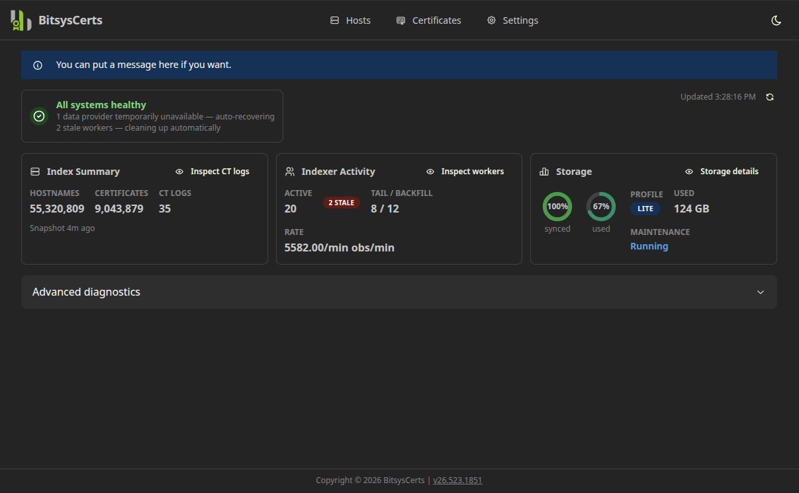
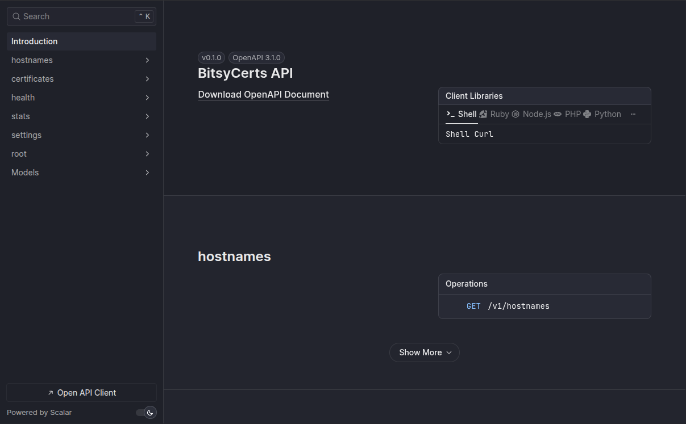

# BitsysCerts

[](https://github.com/bitsyscerts/bitsyscerts/actions/workflows/ci.yml)
[](https://codecov.io/gh/bitsyscerts/bitsyscerts)
[](https://github.com/bitsyscerts/bitsyscerts/releases/latest)
[](https://github.com/bitsyscerts/bitsyscerts/issues)
[](https://github.com/bitsyscerts/bitsyscerts/pulls)

[](https://github.com/bitsyscerts/bitsyscerts/pkgs/container/bitsyscerts-api)
[](https://github.com/bitsyscerts/bitsyscerts/pkgs/container/bitsyscerts-app)

**A self-hostable Certificate Transparency indexing and enrichment platform for security
research, CTI, bug bounty, OSINT, and investigative workflows.**

> Certificate Transparency enrichment without depending on `crt.sh`.

---

## The Problem

Primarily for security researchers and bug bounty hunters, there is often a need to understand the hostnames within a domain. You can't just go to DNS and ask for all of the records. However, [for a few reasons](https://certificate.transparency.dev/), the TLS certificate authorities (CAs) are required by browser policy to publish the details of the certs they are issuing. You would very much think that should be private data, but it's not! So, this data is flowing non-stop as websites get new certs. This concept is called Certificate Transparency (CT) Logs.

1. *"Great, I'll just query it directly!"*, you'll say. First, there isn't really a great API for this, there are ~35 log providers, and there is overlap on many of them. If you did overcome that, the actual data (e.g. hostnames, Subject Alternative Names, etc) is all encoded, so it's not searchable. So, you essentially "can't" search directly. Even if you could, the data is stored in a dense format, so you'd need to decode everything by hand. In the end, this just simply isn't an option.
2. *"Fine, I'll just download everything and decode it myself"*, you'll say. Well, the bad news there is it would take weeks or months to get caught up, and estimates are that ALL of that data is somewhere around 75 TB or more. Plus again, you'd need to decode, organize, and index all of that data.
3. *"This is crazy. Surely someone already offers an index to this data?"*, you'll say. And yes, many people will say *"Just use [crt.sh](https://crt.sh/), that's free!"* - which might be true, I don't know, because I've never visited that site when it was working. It always shows `502 Bad Gateway`. OK, but surely there is a paid option? Yes! This includes offerings like: SSLMate, SecurityTrails, Censys, Validin, and Netlas which may start at ~$500/mo, but could easily go to $1,500/mo+ or more if you want nearly unlimited use.

The problem therefore, is that there is a valuable resource (the CT Log data), that you can't easily use. So, what if we build one, make it free and self-hostable, so that you can store as little or as much of this data as you want. If you just want the last 30 days (and keep hostnames forever) - that might be a few hundred GB. If you want the last year, then you're talking in the low TB's, and if you want all history of all time, that might be 75 TB or more. These are the "Storage Profiles" we talk about in the app, the default is to store as little as possible (e.g. hostnames, cert metadata for the latest cert only), and prune away everything else to save on disk space.


## What It Is

BitsysCerts continuously ingests public Certificate Transparency (CT) log streams,
normalises the data, and makes it queryable through a REST API and a lightweight web UI.





It is designed for operators who want a **private, locally-controlled CT-derived hostname
and certificate intelligence index** — without sending queries to third-party services.

CT data is evidence that a hostname appeared in a publicly logged certificate. It is
**not** proof that the hostname currently resolves, is reachable, or is still operated by
the same entity. BitsysCerts surfaces CT-observed hostnames and certificate-derived
enrichment — not authoritative DNS inventory.

---

## Intended Use

BitsysCerts is designed for security research, threat intelligence, bug bounty, OSINT,
and investigative enrichment workflows.

It is useful when you have a domain, hostname, certificate fingerprint, or suspicious
infrastructure indicator and want to pivot through locally indexed CT data without
relying on external services.

**Example uses:**

- Discovering CT-observed hostnames for a registrable domain.
- Pivoting from a suspicious FQDN to certificates issued around the same period.
- Finding SAN co-occurrence patterns across CT-observed certificates.
- Enriching DNS, TLS, and OSINT investigations with certificate-derived metadata.
- Running a private CT-derived hostname index for self-hosted security tooling.

> [!IMPORTANT]
> BitsysCerts is **not** a real-time production certificate monitoring service, an
> enterprise SLA-backed CT alerting platform, or an authoritative source of DNS truth.

---

## What It Is Not

- A four-nines enterprise monitoring platform or SLA-backed alerting service.
- An up-to-the-second certificate feed — self-hosted deployments may be minutes, hours,
  or days behind some CT logs depending on storage profile, worker count, and network.
- An authoritative DNS or asset inventory source — CT data shows that a hostname appeared
  in a certificate, not that it currently resolves or is reachable.
- A complete replacement for `crt.sh` — BitsysCerts is a complementary, present-focused,
  self-hosted enrichment tool.
- A full historical CT warehouse by default — the `lite` profile retains a
  rolling window, not the complete CT history.

---

## Why Self-Host CT Data

- **Privacy** — hostname and fingerprint queries stay local; nothing is sent to external
  lookup APIs.
- **Speed** — local PostgreSQL queries are faster than round-tripping to a public service.
- **Control** — choose your own retention window, storage profile, and enrichment scope.
- **Integration** — expose the REST API to your own tooling without rate-limit concerns.
- **Offline capability** — once indexed, the data is available even without internet access.

---

## Runtime Modes

BitsysCerts supports three local/runtime modes. They share the same logical
defaults, but each mode has its own environment template and startup path.

| Mode | Use when | Canonical env file | Notes |
|---|---|---|---|
| Developer mode | Contributing from the monorepo in a Dev Container or local checkout | `src/.env.development.example` | Assumes repository structure and editable installs |
| User local Python mode | Running `ctpool` and `certsapi` without Docker | `src/.env.local.example` | PostgreSQL recommended; SQLite is not currently supported |
| User Docker Compose mode | Preferred self-hosted operator runtime | `src/.env.compose.example` | Uses GHCR images, bundled PostgreSQL, dashboard, snapshotter, and maintenance |

GitHub Releases attach curated runtime bundles for the two user-facing modes:

- `bitsyscerts-compose-<version>.zip`
- `bitsyscerts-python-<version>.zip`

The source checkout remains the preferred workflow for contributors.

## Storage Profiles

BitsysCerts supports multiple storage profiles so operators can choose between disk
usage and retained history. Storage profiles are first-class runtime settings stored
in the database. Environment variables are used only as bootstrap defaults on first
startup.

| Profile | Storage class | Recommended for |
|---|---|---|
| `lite` | GB-class | **Default.** Fresh OSINT; rolling retention windows. Start here. |
| `standard` | GB-class | Balanced metadata retention for operators who want more history than Lite |
| `research` | GB–TB-class | Longer lookback; richer certificate metadata for deeper pivots |
| `archive` | TB-class+ | Broad/full retention; **must be explicitly configured** |
| `custom` | Varies | Manual retention tuning when the built-in profiles are not sufficient |

The active profile can be changed at runtime via `PUT /v1/settings/storage` or the
Settings page in the UI. Switching profiles does not delete existing data — the next
prune cycle enforces the new retention windows.

> [!TIP]
> First-time operators should start with `lite`. It is the bootstrap default, the most disk-efficient
> profile and suitable for the majority of security research and OSINT workflows.

> [!CAUTION]
> The `archive` profile requires significant storage capacity (TB-class) and must be
> explicitly configured. It is never activated by default.

---

## Freshness and Completeness

BitsysCerts is designed to be useful even when it is not perfectly caught up.

Depending on storage profile, worker count, log availability, network conditions, and
disk performance, an instance may be minutes, hours, or days behind some CT logs. This
is expected for self-hosted deployments and is not a defect.

The operator dashboard exposes tail lag, backfill progress, failed ranges, audit
findings, storage projections, and worker health so operators can understand the quality
and freshness of their local index.

> [!NOTE]
> BitsysCerts should be treated as a best-effort enrichment source, not a guaranteed
> complete or real-time authority.

---

## Docker Compose Quick Start (Preferred)

Docker Compose is the preferred operator/runtime path. It gives you the bundled
dashboard, PostgreSQL, API, backfill worker, tail worker, stats snapshotter, and
maintenance loop with the least setup churn.

### Requirements

- Linux host with [Docker Engine 25+](https://docs.docker.com/engine/install/) and the
  Compose plugin (`docker compose version` must succeed)
- Outbound HTTPS to public CT log URLs
- Port 80 (or your chosen `FRONTEND_PORT`) reachable from your browser

### Release bundle path

Download `bitsyscerts-compose-<version>.zip` from GitHub Releases, extract it, then run:

```sh
cp .env.compose.example .env
$EDITOR .env

./server-deploy.sh
docker compose run --rm migrate ctpool status
docker compose run --rm migrate ctpool workers list
docker compose run --rm migrate ctpool backfill-state
docker compose run --rm migrate ctpool prune-for-storage-profile --dry-run
```

`server-deploy.sh` runs migrations, syncs the CT log list, seeds one stats snapshot,
and runs one maintenance pass before starting the long-running services. If the
dashboard still says no snapshot yet after startup, run:

```sh
docker compose run --rm migrate ctpool stats-snapshot
```

To validate a downloaded compose bundle before first boot, extract it and run:

```sh
cp .env.compose.example .env
docker compose config >/dev/null
```

### Source checkout path

If you are running from the repository instead of a release bundle:

```sh
cd src
cp .env.compose.example .env
$EDITOR .env

./deploy.sh
docker compose run --rm migrate ctpool status
docker compose run --rm migrate ctpool workers list
docker compose run --rm migrate ctpool backfill-state
docker compose run --rm migrate ctpool prune-for-storage-profile --dry-run
```

Once the stack is up, open `http://<your-host>/` in a browser. `/v1/stats` is enabled by
default in this mode because the bundled dashboard depends on it.

## Local Python Quick Start

Local Python mode is supported for users who cannot run Docker but can run Python.
It does not assume a process supervisor or container paths.

> [!IMPORTANT]
> PostgreSQL is recommended for sustained ingestion. SQLite is not currently
> supported by the packaged runtime.

Use either the full source checkout or `bitsyscerts-python-<version>.zip`, then:

```sh
python -m venv .venv
source .venv/bin/activate

pip install ./src/ctpool ./src/api
```

If you are running from the extracted python bundle:

```sh
cp .env.local.example .env
$EDITOR .env
set -a
source .env
set +a
```

If you are running from the source checkout:

```sh
cp src/.env.local.example src/.env
$EDITOR src/.env
set -a
source src/.env
set +a
```

Then start the services:

```sh
cd src/ctpool
ctpool apply-migrations
ctpool sync-logs
ctpool stats-snapshot
ctpool maintenance
ctpool status

cd ../api
certsapi serve --host 127.0.0.1 --port 8000
```

If you want the bundled dashboard from a full checkout or runtime bundle and you have Node
available, start it separately:

```sh
cd src/app
npm ci
npm run dev -- --host 127.0.0.1
```

## Developer Mode

Developer mode keeps the monorepo layout intact and assumes editable installs, a source
checkout, and repository-local commands.

```sh
cp src/.env.development.example src/.env
set -a
source src/.env
set +a

cd src/ctpool
python -m pytest -q

cd ../api
python -m pytest -q

cd ../app
npm run test -- --run
```

For the full contributor setup, see [.github/CONTRIBUTING.md](.github/CONTRIBUTING.md).

---

## API and Integrations

The REST API is available at `http://<your-host>/v1/`. Interactive documentation (Scalar)
is at `http://<your-host>/docs`.

| Endpoint | Description |
|---|---|
| `GET /v1/hostnames` | Search CT-observed hostnames with cursor pagination |
| `GET /v1/certificates/{sha256}` | Full certificate detail by SHA-256 fingerprint |
| `GET /v1/stats` | Ingestion and storage statistics |
| `GET /v1/settings/storage` | Read active retention profile |
| `PUT /v1/settings/storage` | Update retention profile |
| `GET /health` | Liveness probe |

The API follows the OpenAPI 3.1 specification. The schema is at `/openapi.json`.

BitsysCerts exposes a product API over locally indexed CT-derived data. This API is not
the CT log protocol itself — CT log protocol behaviour is used on the ingestion side only.

> [!NOTE]
> CT data reflects public certificate observations and may be historical. Results
> represent CT-observed hostnames, not a complete or current DNS inventory.

---

## Certificate Transparency Stewardship

BitsysCerts is a CT indexer, not a CT log operator.

The ingestion pipeline is designed to read public CT logs respectfully: honouring
per-log rate limits, backing off on HTTP 429, maintaining per-log cursors, and using
bounded concurrency. Operators should tune worker count, retention windows, and storage
profiles responsibly.

See [docs/CT_STEWARDSHIP.md](docs/CT_STEWARDSHIP.md) for the full stewardship policy.

---

## Architecture

See [docs/ARCHITECTURE.md](docs/ARCHITECTURE.md) for the full system diagram, data flow,
database schema, and deployment topology.

```
src/
  api/      # Python · FastAPI · PostgreSQL — REST API
  app/      # React · Vite · Mantine — web UI
  ctpool/   # Python · Typer — CT ingestion pipeline and CLI
docs/
  PRD.md              # Product requirements and scope
  ARCHITECTURE.md     # System architecture, data flow, deployment topology
  CT_STEWARDSHIP.md   # CT log access policy and stewardship
  STYLE_GUIDE.md      # Code style reference
```

---

## Manual Operations (CLI)

In Docker Compose mode, prefer the one-shot `migrate` service for ad hoc operator commands:

```sh
# Snapshot and status
docker compose run --rm migrate ctpool stats-snapshot
docker compose run --rm migrate ctpool status

# Sync logs or run maintenance once
docker compose run --rm migrate ctpool sync-logs
docker compose run --rm migrate ctpool maintenance

# Advanced / debug legacy compatibility tools
docker compose run --rm migrate ctpool legacy-ranges status
docker compose run --rm migrate ctpool reap-stale-backfill-claims

# Advanced / debug audit tools
docker compose run --rm migrate ctpool check-audit-gaps

# Preview audit repairs
docker compose run --rm migrate ctpool fix-audit-findings --dry-run

# Reset migrations and reinitialise (destructive)
docker compose run --rm migrate ctpool init-db --force
```

`ctpool backfill` uses per-log dispatch by default. `legacy-ranges`,
`reap-stale-backfill-claims`, `check-audit-gaps`, and `fix-audit-findings`
are retained for compatibility, troubleshooting, and one-off historical repair.

---

## Contributing

See [.github/CONTRIBUTING.md](.github/CONTRIBUTING.md) for setup instructions, branching
conventions, commit format, and the pull request process.

All contributions must:

- Ship with tests (75% coverage gate on all dimensions)
- Pass `pytest` (Python) and `npm run test` (React) with no linting suppressions
- Follow the [style guide](docs/STYLE_GUIDE.md)

---

## License

[MIT](LICENSE) — free to use, modify, and commercialise. Provided as-is, without warranty.


