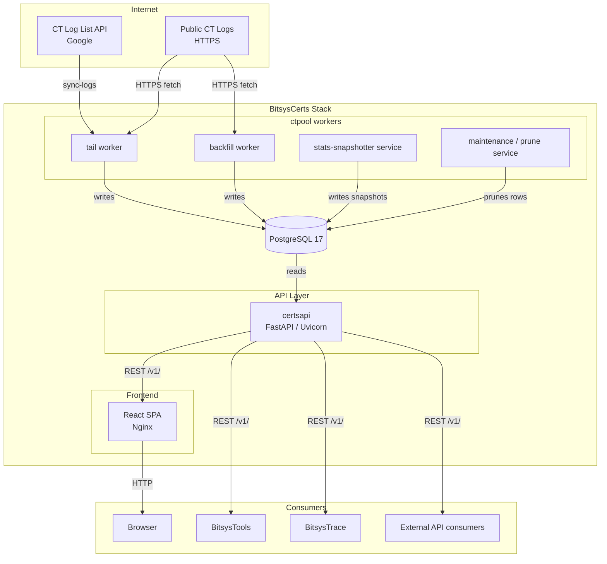
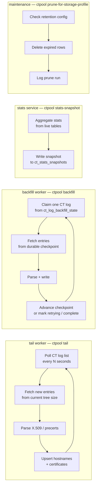
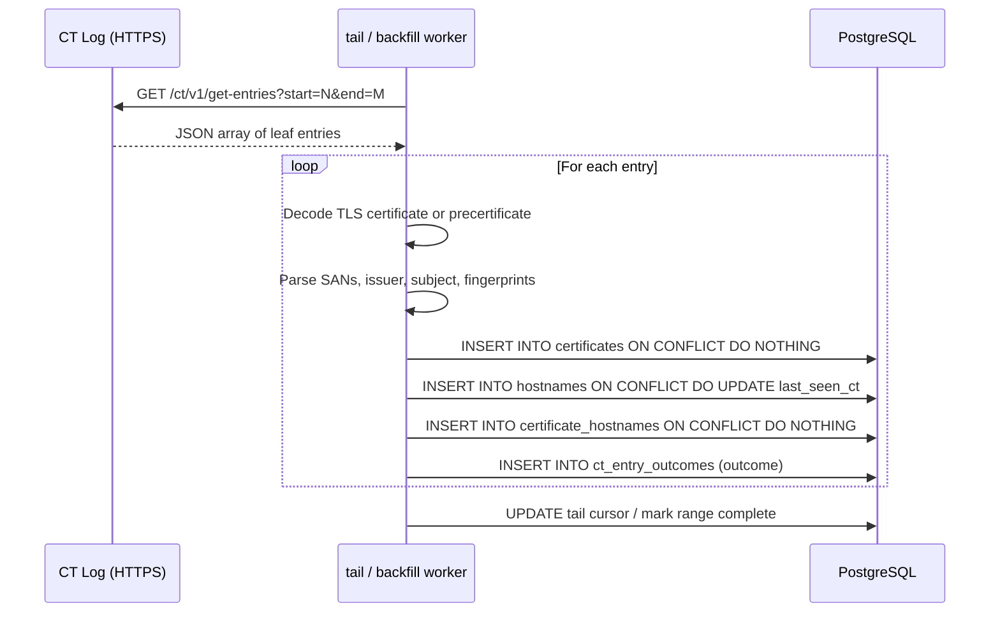
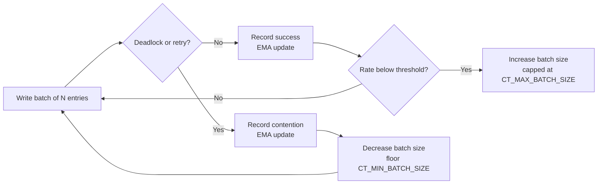
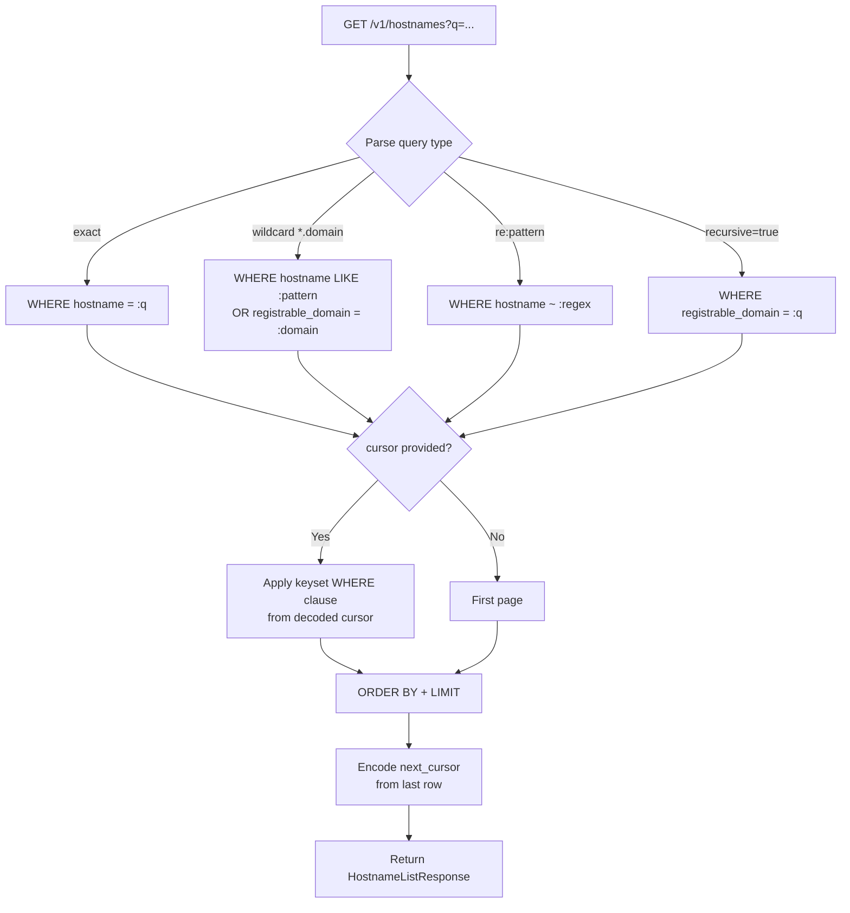
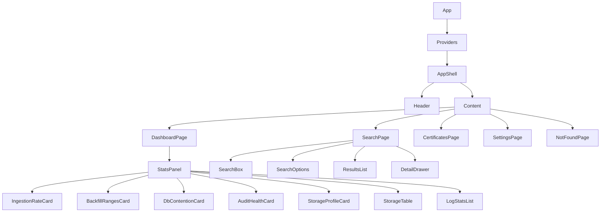
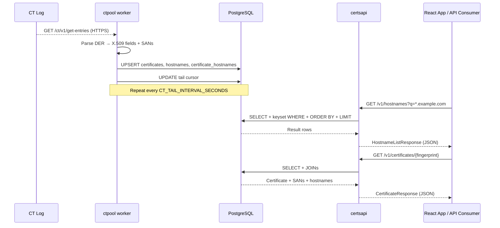
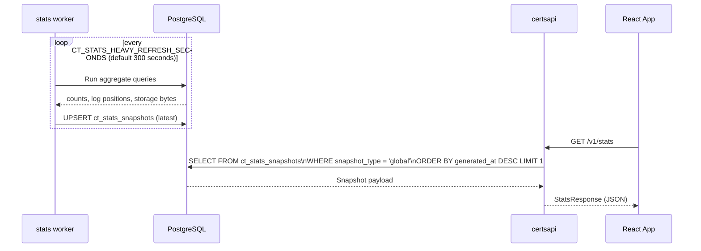
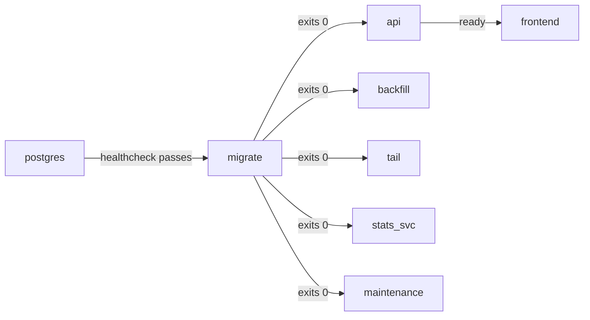

# Architecture — BitsysCerts

> [!NOTE]
> This document describes the deployed architecture of BitsysCerts as implemented.
> For product-level requirements and scope decisions, see [PRD.md](PRD.md).

---

## Table of Contents

- [System Overview](#system-overview)
- [Component Map](#component-map)
- [Sub-Project: ctpool (Ingestion)](#sub-project-ctpool-ingestion)
- [Sub-Project: certsapi (API)](#sub-project-certsapi-api)
- [Sub-Project: app (Frontend)](#sub-project-app-frontend)
- [Database Schema](#database-schema)
- [Data Flow](#data-flow)
- [Deployment Topology](#deployment-topology)
- [Configuration Reference](#configuration-reference)
- [Security Model](#security-model)
- [Technology Stack](#technology-stack)

---

## System Overview

BitsysCerts is composed of three sub-projects that communicate only through a shared
PostgreSQL database and a single REST API boundary.



> [!IMPORTANT]
> The only externally exposed service is the frontend (Nginx). The API is proxied through
> Nginx — it is not directly port-mapped to the host by default. All CT ingestion traffic
> is **outbound only**.

---

## Component Map

| Component | Language | Package | Docker Service | Role |
|---|---|---|---|---|
| `ctpool` | Python 3.12 | `src/ctpool` | `tail`, `backfill`, `stats-snapshotter`, `maintenance` | CT ingestion, data pruning, audit |
| `certsapi` | Python 3.12 | `src/api` | `api` | Read-only REST API |
| `app` | TypeScript / React 18 | `src/app` | `frontend` | Reference web UI |
| PostgreSQL 17 | — | — | `postgres` | Primary data store |
| Alembic | Python | `src/ctpool` | `migrate` | Schema migration runner |

---

## Sub-Project: ctpool (Ingestion)

`ctpool` is a Typer-based CLI application that runs several long-lived worker processes
and a suite of on-demand maintenance commands.

### Worker Services



### Ingestion Pipeline (per CT entry)



### Adaptive Contention Control

The `db_contention_*` module family implements an adaptive batch-size controller that
observes deadlock/retry rates from PostgreSQL and adjusts the per-transaction batch size
using an Exponential Moving Average (EMA). This prevents write storms during high-load
backfill operations.



### Disk Guard

Before each write cycle, the disk guard checks available space on the PostgreSQL data
directory mount. If free space drops below `CT_MIN_FREE_DISK_GB`, a warning is logged.
If free space drops below `CT_CRITICAL_FREE_DISK_GB`, ingestion is halted and an error
is written to the health/log channel.

### Backfill Dispatch Model

BitsysCerts uses **per-log backfill ownership** by default. Each backfill worker claims
one eligible CT log, processes it from its durable checkpoint stored in
`ct_log_backfill_state`, heartbeats its claim, and either advances the checkpoint,
marks the log `retrying` on retryable errors, or marks it `complete` when the window is
finished. There is at most one worker per log at any time.

The legacy range-based dispatcher (`ct_log_backfill_ranges`) remains available for
compatibility and debug use under `CT_BACKFILL_DISPATCH_MODE=legacy-ranges` or
`ctpool backfill --dispatch-mode legacy-ranges`. It is **not** the default runtime
model.

Legacy range failures from older runs may remain visible in advanced diagnostics. They
do not necessarily indicate that the current per-log dispatcher is unhealthy.

### Audit Checker

> **Advanced / debug only.** The audit checker is not part of normal per-log operation.
> Per-log workers handle retryable failures inline by transitioning the log to
> `retrying` and re-fetching from the unchanged checkpoint. The audit/repair commands
> below remain available for legacy range investigation and one-off historical
> reconciliation.

`ctpool check-audit-gaps` / `ctpool fix-audit-findings` detect and repair:

- Gaps in CT log entry ranges (entries that should have been fetched but were not)
- Hostnames with a missing or stale `latest_cert_fingerprint_sha256` reference
- Legacy backfill ranges stuck in `in_progress` past their claim timeout

---

## Sub-Project: certsapi (API)

`certsapi` is a FastAPI application served by Uvicorn. It is **read-only** — it never
writes to the database directly. Settings mutations via `PUT /v1/settings/storage` use a
dedicated write path with audit logging.

### Router Structure

```
certsapi/
  app.py              ← FastAPI app, middleware, exception handlers
  database.py         ← AsyncSession factory, connection pool
  config.py           ← Settings via pydantic-settings
  hostnames/
    router.py         ← GET /v1/hostnames
    service.py        ← Query construction, cursor encoding/decoding
    models.py         ← Pydantic request/response models
  certificates/
    router.py         ← GET /v1/certificates/{fingerprint_sha256}
    service.py        ← Certificate + SAN + hostname joins
    models.py
  stats/
    router.py         ← GET /v1/stats
    service.py        ← Latest snapshot fetch
    models.py
  settings/
    router.py         ← GET/PUT /v1/settings/storage
    service.py        ← Profile validation, settings write
    models.py
  health/
    router.py         ← GET /health
  root/
    router.py         ← GET /
```

### Hostname Search Query Logic



### Cursor-Based Pagination

BitsysCerts uses keyset pagination (not offset). Cursors are opaque base64-encoded JSON
blobs containing the sort key values of the last returned row. This provides stable,
performant pagination over large result sets without skipping or duplicating rows when
concurrent writes occur.

> [!NOTE]
> The API returns `total_estimate` capped at `10,001`. This is a sentinel value indicating
> the result set exceeds the estimation threshold. Do not use `total_estimate` for UI
> pagination math — use `next_cursor` presence instead.

### Stats Caching

The `GET /v1/stats` endpoint never executes a live aggregate query. It reads the most
recent row from `ct_stats_snapshots` written by the `stats-snapshotter` worker service.
The snapshot worker refreshes this row on the configured heavy-refresh interval
(`CT_STATS_HEAVY_REFRESH_SECONDS`, default `300`). This keeps dashboard load under
control for large deployments.

---

## Sub-Project: app (Frontend)

The React application is a single-page application (SPA) built with Vite and served by
Nginx. It communicates with the API exclusively through the Nginx reverse proxy.

### Page and Component Hierarchy



### State Management

| State type | Mechanism | Scope |
|---|---|---|
| Server data (API responses) | TanStack Query (`useQuery`) | Component subtree |
| Search query / options | `SearchStateContext` | App-wide |
| Selected certificate | `CertStateContext` | App-wide |
| Theme (dark/light) | `ColorSchemeContext` | App-wide |
| Navigation / current page | `PageContext` + React Router | App-wide |

### Nginx Routing

```nginx
location /v1/ {
    proxy_pass http://api:8000;    # Internal Docker network
}

location / {
    try_files $uri $uri/ /index.html;    # SPA fallback
}
```

---

## Database Schema

### Entity Relationship (Simplified)

```mermaid
erDiagram
    certificates {
        uuid id PK
        text fingerprint_sha256 UK
        text spki_sha256
        text serial_number
        text issuer_dn
        text issuer_common_name
        text issuer_organization
        text subject_dn
        text subject_common_name
        timestamptz not_before
        timestamptz not_after
        text signature_algorithm_oid
        text public_key_algorithm_oid
        text public_key_bits_or_curve
        bool is_precertificate
        bool is_wildcard_present
        int san_count
        timestamptz first_seen_ct
        timestamptz last_seen_ct
    }

    hostnames {
        uuid id PK
        text hostname UK
        text registrable_domain
        bool is_wildcard
        timestamptz first_seen_ct
        timestamptz last_seen_ct
        text latest_cert_fingerprint_sha256 FK
        timestamptz latest_cert_not_before
        timestamptz latest_cert_not_after
    }

    certificate_hostnames {
        uuid certificate_id FK
        uuid hostname_id FK
    }

    ct_log_sources {
        uuid id PK
        text log_id_b64 UK
        text operator_name
        text url UK
        text log_state
        bool is_eligible_for_tail
        bool is_eligible_for_backfill
        timestamptz first_synced_at
        timestamptz last_synced_at
    }

    ct_log_tail_cursors {
        uuid log_source_id PK FK
        bigint start_index
        bigint current_index
    }

    ct_log_backfill_ranges {
        uuid id PK
        uuid log_source_id FK
        bigint start_index
        bigint end_index
        bigint next_index
        text status
        text claimed_by
        timestamptz claimed_at
        timestamptz completed_at
    }

    ct_entry_outcomes {
        uuid id PK
        uuid log_source_id FK
        bigint ct_log_entry_id
        text outcome
        jsonb metadata
        timestamptz created_at
    }

    ct_instance_settings {
        uuid id PK
        text storage_profile
        text cert_storage_mode
        int backfill_days
        int cert_retention_days
        int observation_retention_days
        int entry_outcome_retention_days
        int metrics_retention_days
        text settings_hash UK
        jsonb settings_json
        timestamptz updated_at
        text updated_by
    }

    ct_stats_snapshots {
        uuid id PK
        text snapshot_type
        timestamptz generated_at
        int duration_ms
        jsonb payload_json
    }

    ct_audit_findings {
        uuid id PK
        uuid log_source_id FK
        bigint entry_range_start
        bigint entry_range_end
        text severity
        text description
        timestamptz created_at
    }

    certificates ||--o{ certificate_hostnames : "covers"
    hostnames ||--o{ certificate_hostnames : "covered by"
    ct_log_sources ||--o{ ct_log_backfill_ranges : "has"
    ct_log_sources ||--|| ct_log_tail_cursors : "has"
    ct_log_sources ||--o{ ct_entry_outcomes : "produces"
    ct_log_sources ||--o{ ct_audit_findings : "has"
    hostnames }o--o| certificates : "latest cert"
```

### Key Indexes

| Table | Index | Purpose |
|---|---|---|
| `certificates` | `UQ fingerprint_sha256` | Deduplication on write |
| `hostnames` | `UQ hostname` | Deduplication on write |
| `hostnames` | `IX registrable_domain` | Recursive search |
| `hostnames` | `IX last_seen_ct DESC` | Recent-first ordering |
| `ct_log_sources` | `UQ log_id_b64`, `UQ url` | Log sync deduplication |
| `ct_log_backfill_ranges` | `IX log_source_id, status` | Range claim queries |
| `ct_stats_snapshots` | `IX snapshot_type, generated_at DESC` | Latest snapshot fetch |
| `ct_entry_outcomes` | `IX created_at` | Retention pruning |

---

## Data Flow

### End-to-End: CT Log Entry → API Response



### Stats Snapshot Refresh



---

## Deployment Topology

### Docker Compose Services

```mermaid
graph TB
    subgraph host[Docker Host]
        subgraph network[internal Docker network]
            postgres[(postgres:17-alpine\nport 5432)]
            migrate[migrate\nctpool apply-migrations]
            api[api\ncertsapi serve\nport 8000]
            frontend[frontend\nnginx:1.27-alpine\nport 80/443]
            backfill[backfill\nctpool backfill]
            tail[tail\nctpool tail]
            stats_svc[stats-snapshotter\nctpool stats-snapshot --loop]
            maintenance[maintenance\nctpool maintenance --loop]
        end
        vol_pg[(postgres_data\nvolume)]
        vol_disk[/data/pgcheck\nread-only bind mount]
    end

    internet((Internet)) -->|HTTPS inbound| frontend
    frontend -->|proxy /v1/*| api
    api -->|SQLAlchemy async| postgres
    backfill -->|psycopg async| postgres
    tail -->|psycopg async| postgres
    stats_svc -->|psycopg async| postgres
    maintenance -->|psycopg async| postgres
    migrate -->|alembic| postgres
    postgres --- vol_pg
    maintenance --- vol_disk
    backfill --- vol_disk
    tail --- vol_disk
```

### Service Start Order



> [!WARNING]
> The `migrate` service must exit cleanly before any other service starts. Docker Compose
> `depends_on: condition: service_completed_successfully` enforces this. Do not remove
> these dependency declarations.

---

## Configuration Reference

All configuration is via environment variables. The canonical env template depends on the
runtime mode:

| Mode | Canonical env template |
|---|---|
| Developer mode | `src/.env.development.example` |
| Local Python mode | `src/.env.local.example` |
| Docker Compose mode | `src/.env.compose.example` |

The source checkout keeps `.env` in `src/`. Release bundles keep `.env` beside the shipped
runtime files.

### Common (all services)

| Variable | Default | Description |
|---|---|---|
| `DATABASE_URL` | — | **Required.** PostgreSQL async DSN |
| `DATABASE_ADMIN_URL` | — | Optional admin DSN for database creation workflows |
| `LOG_LEVEL` | `INFO` | Shared Python log level |

### API (certsapi)

| Variable | Default | Description |
|---|---|---|
| `APP_NAME` | `BitsyCerts API` | API metadata shown in root/OpenAPI responses |
| `APP_VERSION` | `0.1.0` | API version string |
| `DEFAULT_PAGE_LIMIT` | `50` | Default page size for list endpoints |
| `MAX_PAGE_LIMIT` | `200` | Hard page-size ceiling |
| `BITSYSCERTS_EXPOSE_STATS_API` | `true` | Enables `/v1/stats`; default-on because the bundled dashboard depends on it |
| `STATS_STALE_SECONDS` | `120` | Snapshot age threshold before the API marks stats as stale |

### Bootstrap defaults

These values seed `ct_instance_settings` only when the database does not yet contain a row.
They do not override the database-backed settings after first boot.

| Variable | Default | Description |
|---|---|---|
| `BITSYSCERTS_BOOTSTRAP_PROFILE` | `lite` | Initial storage profile |
| `BITSYSCERTS_BOOTSTRAP_BACKFILL_DAYS` | profile default | Optional first-run backfill override |
| `BITSYSCERTS_BOOTSTRAP_CERT_STORAGE_MODE` | profile default | Optional first-run certificate storage override |

### Ingestion (ctpool)

| Variable | Default | Description |
|---|---|---|
| `CT_BACKFILL_DAYS` | `30` | Historical lookback for new logs |
| `CT_BACKFILL_DISPATCH_MODE` | `per-log` | Default backfill ownership model |
| `CT_TAIL_INTERVAL_SECONDS` | `300` | Poll interval for tail worker |
| `CT_DEFAULT_BATCH_SIZE` | `256` | Starting batch size for writes |
| `CT_MAX_BATCH_SIZE` | `1024` | Upper bound for adaptive batch sizing |
| `CT_MIN_BATCH_SIZE` | `16` | Lower bound for adaptive batch sizing |
| `CT_HTTP_TIMEOUT_SECONDS` | `30` | HTTP timeout for CT log requests |
| `CT_STORAGE_PROFILE` | `lite` | Active storage profile when no database override exists yet |
| `CT_DISK_CHECK_PATH` | mode-specific | Filesystem path used for free-disk checks |
| `CT_MIN_FREE_DISK_GB` | `50` | Warn threshold (GB free on PG data mount) |
| `CT_CRITICAL_FREE_DISK_GB` | `20` | Halt threshold (GB free on PG data mount) |
| `CT_STATS_HEAVY_REFRESH_SECONDS` | `300` | Snapshot cadence for heavier aggregated metrics |
| `CT_MAINTENANCE_INTERVAL_SECONDS` | `3600` | Maintenance loop cadence |
| `BITSYSCERTS_ENABLE_SCHEDULED_AUDIT` | `false` | Opt-in deep audit loop |

### Frontend

| Variable | Default | Description |
|---|---|---|
| `FRONTEND_PORT` | `80` | Host port mapped to Nginx container |
| `POSTGRES_PASSWORD` | — | Required only when using the bundled Compose PostgreSQL service |

---

## Security Model

> [!IMPORTANT]
> This section summarises the security design. For the full OWASP checklist applied during
> development, see [.github/instructions/security.instructions.md](../.github/instructions/security.instructions.md).

### Threat Model Summary

| Threat | Mitigation |
|---|---|
| SQL injection via hostname query | Parameterised queries only (SQLAlchemy); Pydantic validates all inputs before DB access |
| Regex injection via `re:` search mode | Regex is validated and sandboxed; length-limited before evaluation |
| Sensitive data exposure | API is read-only for certificate/hostname data; no credentials stored in DB |
| CT log data tampering | BitsysCerts is a read-only consumer; it does not validate CT log Merkle proofs (out of scope) |
| Unbounded result sets | All list endpoints are paginated with a hard `max_limit` enforced in Pydantic |
| Credential leakage | All secrets via environment variables; never hardcoded or logged |
| SSRF via CT log URL | CT log URLs fetched only from the synced log list (not user-supplied) |
| Denial of service | Stats endpoint served from snapshot cache; no unbounded aggregates on the hot path |

### Network Exposure

- The **frontend (Nginx)** is the only service with an external host port binding.
- The **API** is accessible only through the Nginx reverse proxy within the Docker network.
- **PostgreSQL** has no host port binding in the default Compose configuration.
- All CT ingestion traffic is **outbound HTTPS only** from the `tail` and `backfill` workers.

---

## Technology Stack

| Layer | Technology | Version |
|---|---|---|
| **Ingestion runtime** | Python | 3.12 |
| **Ingestion framework** | Typer | 0.25.x |
| **API runtime** | Python | 3.12 |
| **API framework** | FastAPI | 0.115.x |
| **API server** | Uvicorn | 0.34.x |
| **ORM** | SQLAlchemy async | 2.0.x |
| **DB driver** | psycopg (v3 binary) | 3.3.x |
| **Schema migrations** | Alembic | 1.18.x |
| **Validation** | Pydantic v2 | 2.13.x |
| **CT parsing** | cryptography (X.509) | 47.0.x |
| **TLD extraction** | tldextract | 5.3.x |
| **Database** | PostgreSQL | 17 |
| **Frontend runtime** | Node | 22 |
| **Frontend framework** | React | 18.3.x |
| **Build tool** | Vite | 6.3.x |
| **UI library** | Mantine | 7.17.x |
| **Server state** | TanStack Query | 5.x |
| **Router** | React Router | 7.x |
| **Language (frontend)** | TypeScript | 5.8.x |
| **API docs** | Scalar | latest |
| **Web server** | Nginx | 1.27-alpine |
| **Container runtime** | Docker + Compose v2 | 24.x / 2.x |
| **Python linter** | ruff | 0.15.x |
| **Python types** | mypy (strict) | 1.20.x |
| **JS linter** | ESLint + Airbnb | 9.x |
| **Python tests** | pytest + pytest-asyncio | 9.x |
| **Frontend tests** | Vitest + React Testing Library | 3.x / 16.x |

---

## CI / CD Pipeline

The pipeline is implemented in `.github/workflows/ci.yml` and follows a
**fan-out / fan-in** design with two guiding principles:

1. **Run everything, see everything** — all validation jobs run in parallel;
   CI always collects every failure before the gate evaluates, so you never
   fix one problem only to discover the next one on the following push.
2. **Atomic versioned deployments** — because all publish jobs share a single
   `gate` dependency, the API image, App image, and runtime bundles are either
   all published at the same version tag or none of them are.

### Job graph

```
version ──────────────────────────────────────────────────────────────────┐
                                                                          │
semgrep ────┐                                                             │
test-api ───┼──→  gate  ──→  build-push-api ──┐                          │
test-ctpool ┤   (all must      build-push-app ──┼──→  release             │
test-app ───┘    pass)         pkg-bundles ────┘  └──→  pre-release       │
                                    ↑                                     │
                                    └──────────── needs version ──────────┘
```

### Phase descriptions

| Phase | Jobs | Runs on |
|---|---|---|
| **Validate** | `semgrep`, `test-api`, `test-ctpool`, `test-app` | Every push and PR |
| **Gate** | `gate` | Passes only when all four validate jobs pass |
| **Publish** | `build-push-api`, `build-push-app`, `package-runtime-bundles` | Push events only (`if: github.event_name == 'push'`) |
| **Release** | `release` (stable), `pre-release` (staging/develop/release/*) | Push to qualifying branches only |

### Version tagging

The `version` job runs in parallel with validation and outputs three version
strings used by publish jobs:

| Output | Format | Example |
|---|---|---|
| `version_core` | `yy.mdd.hhmm` | `26.516.1423` |
| `version_pep440` | PEP 440 local segment on non-main | `26.516.1423+staging.abc1234` |
| `version_docker` | Docker-safe tag | `26.516.1423-staging-abc1234` |

Both container images and runtime bundle ZIP files are tagged with
`version_docker`. GitHub Releases on `main` use `version_core`.

### SAST

Semgrep runs as a hard gate — any finding fails the `semgrep` job, which
fails the `gate`, which prevents all publish steps from running. Findings
are also uploaded to the GitHub Security tab as SARIF for triage.
