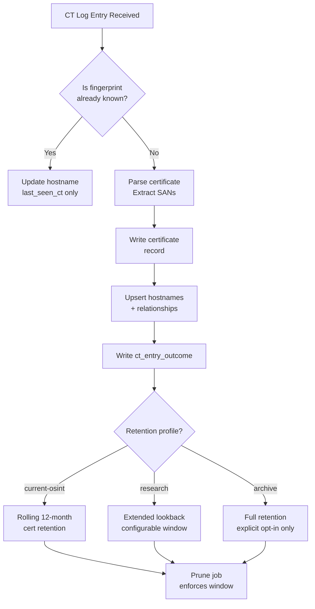
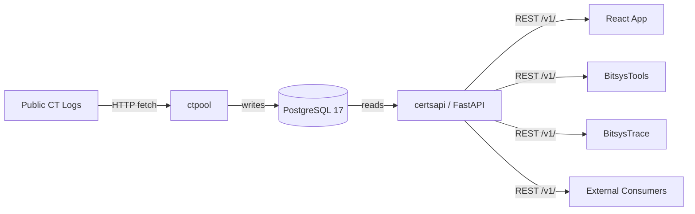

# Product Requirements Document — BitsysCerts

> [!NOTE]
> This document describes the product as it is designed and built. It is not a roadmap.
> Unimplemented capabilities are marked **Future** and are outside the current scope.

---

## Table of Contents

- [Product Vision](#product-vision)
- [Target Users](#target-users)
- [Core Use Cases](#core-use-cases)
- [Functional Requirements](#functional-requirements)
- [Retention Model](#retention-model)
- [Non-Goals](#non-goals)
- [Integration Boundaries](#integration-boundaries)
- [Deployment Model](#deployment-model)
- [Success Criteria](#success-criteria)
- [Glossary](#glossary)

---

## Product Vision

BitsysCerts is a **self-hostable Certificate Transparency intelligence service** for current
hostname discovery, certificate metadata lookup, and OSINT pivot support.

It ingests Certificate Transparency (CT) log streams, normalises the data, and exposes it
through a queryable REST API and a lightweight reference web UI. The product is designed to
answer practical, present-tense questions about hostnames and certificates — not to mirror
the complete historical state of the internet's public CT ecosystem.

> [!IMPORTANT]
> BitsysCerts is **not** a replacement for `crt.sh` or a general-purpose CT archive.
> Its default retention mode is `current-osint`, which retains fresh signal over deep
> history. This is a deliberate design constraint, not a limitation to be worked around.

---

## Target Users

| User | Role | Primary Need |
|---|---|---|
| Security researcher | Individual / team | Discover subdomains and hostnames for a target domain; pivot on certificate relationships |
| Red team / penetration tester | Individual / team | Enumerate attack surface; identify recently issued or expiring certificates |
| Threat intelligence analyst | SOC / MSSP | Monitor new hostname observations for suspicious domains or issuers |
| Platform engineer (BitsysTools / BitsysTrace) | Developer | Consume BitsysCerts as a structured CT data source for downstream tooling |
| Self-hoster | Individual | Run a private CT intelligence service without relying on public third-party APIs |

---

## Core Use Cases

### UC-1: Hostname Discovery

**Actor:** Security researcher  
**Goal:** Find all recently observed hostnames for a given registered domain.

**Query patterns:**

| Pattern | Meaning |
|---|---|
| `example.com` | Exact match on hostname |
| `*.example.com` | All subdomains of `example.com` |
| `re:^api\..*\.example\.com$` | Regex match against hostname |
| `example.com` + `recursive=true` | All hostnames sharing the same registrable domain |

**Expected output:** Paginated list of hostnames with first/last CT observation timestamps
and latest certificate summary.

---

### UC-2: Certificate Metadata Lookup

**Actor:** Security researcher, threat intelligence analyst  
**Goal:** Retrieve full certificate metadata for a known SHA-256 fingerprint.

**Input:** `GET /v1/certificates/{fingerprint_sha256}`

**Expected output:** Full certificate record including issuer, subject, validity window,
Subject Alternative Names, key algorithm, precertificate flag, and all known hostnames
that referenced this certificate.

---

### UC-3: Subdomain Enumeration with Depth Control

**Actor:** Penetration tester  
**Goal:** Enumerate hostnames at a specific label depth under a domain.

**Example:** Find all third-level hostnames under `example.com` (e.g., `api.example.com`,
`www.example.com`) without returning fourth-level names.

**Query:** `q=*.example.com&depth=3&recursive=false`

---

### UC-4: Operational Dashboard

**Actor:** Self-hoster, platform engineer  
**Goal:** Monitor CT ingestion health, storage consumption, and backfill progress at a
glance without querying the database directly.

**Dashboard surfaces:**

- Total hostname and certificate counts
- Per-CT-log tail position and ingestion rate
- Backfill job queue (pending / in-progress / completed / failed)
- Database contention metrics (deadlock rate, adaptive batch sizing)
- Storage usage by table
- Active storage profile and retention windows
- Audit health (data integrity gap count)

---

### UC-5: Storage Profile Management

**Actor:** Self-hoster  
**Goal:** Switch between retention profiles to control storage consumption and data
richness without redeploying.

**Profiles:**

| Profile | Storage class | Notes |
|---|---|---|
| `current-osint` | GB-class | **Default.** Fresh OSINT; rolling retention windows |
| `research` | GB–TB-class | Longer lookback; richer metadata |
| `archive` | TB-class+ | Full CT archival; **must be explicitly enabled** |

---

### UC-6: Platform Integration (API Consumer)

**Actor:** BitsysTools, BitsysTrace, or any third-party tool  
**Goal:** Query BitsysCerts programmatically using its REST API for hostname and
certificate data.

**Interface:** OpenAPI-described REST API at `/v1/`. Interactive documentation at `/docs`.

---

## Functional Requirements

### Ingestion (ctpool)

| ID | Requirement | Priority |
|---|---|---|
| ING-1 | Fetch and normalise the public CT log list from the Google CT Log List API | Must |
| ING-2 | Tail each eligible CT log from its current tree size at a configurable interval | Must |
| ING-3 | Backfill CT logs from a configurable lookback window (default: 30 days) | Must |
| ING-4 | Parse X.509 and precertificate entries; extract SANs, issuer, subject, fingerprints | Must |
| ING-5 | Deduplicate certificates by SHA-256 fingerprint | Must |
| ING-6 | Maintain durable hostname state (first/last seen) with upsert semantics | Must |
| ING-7 | Honour disk-space guard thresholds; abort ingestion before disk exhaustion | Must |
| ING-8 | Adaptive batch sizing under database contention using EMA smoothing | Should |
| ING-9 | Expose data-integrity audit checks with automated repair strategies | Should |
| ING-10 | Support configurable retention pruning for all bounded tables | Must |

### API (certsapi)

| ID | Requirement | Priority |
|---|---|---|
| API-1 | `GET /v1/hostnames` — hostname search with cursor-based pagination | Must |
| API-2 | Support exact, wildcard (`*.domain`), regex (`re:pattern`), and recursive search modes | Must |
| API-3 | `GET /v1/certificates/{fingerprint_sha256}` — full certificate detail by fingerprint | Must |
| API-4 | `GET /v1/stats` — ingestion and storage statistics from cached snapshots | Must |
| API-5 | `GET/PUT /v1/settings/storage` — read and update active storage configuration | Must |
| API-6 | `GET /health` — liveness probe for orchestrators | Must |
| API-7 | Interactive OpenAPI documentation at `/docs` (Scalar) | Should |
| API-8 | All query parameters validated with Pydantic before database access | Must |
| API-9 | Cursor-based pagination (keyset); no offset-based pagination | Must |
| API-10 | Stats endpoint returns from a cached snapshot; never blocks on a live aggregate query | Must |

### Frontend (app)

| ID | Requirement | Priority |
|---|---|---|
| UI-1 | Dashboard page with live-refreshing (10 s) ingestion and storage metrics | Must |
| UI-2 | Hostname search page with query input, filter controls, and paginated results | Must |
| UI-3 | Detail drawer for hostname and certificate detail | Must |
| UI-4 | Settings page for storage profile management | Must |
| UI-5 | Dark / light mode toggle | Should |
| UI-6 | Responsive layout usable on desktop and tablet | Should |
| UI-7 | Accessible interactive elements (ARIA labels, keyboard navigation) | Must |
| UI-8 | Error boundaries on all pages with meaningful fallback UI | Must |

---

## Retention Model

BitsysCerts uses a tiered retention model controlled by the active storage profile. All
ingestion code must honour the active profile.

### Data Retention by Class

| Data Class | `current-osint` | `research` | `archive` |
|---|---|---|---|
| Hostname state | Indefinite | Indefinite | Indefinite |
| Certificate records | Rolling 12 months | Configurable | Indefinite |
| CT entry outcomes | 30–180 days | Configurable | Configurable |
| Backfill range metadata | Until completed | Until completed | Until completed |
| Stats snapshots | Configurable | Configurable | Configurable |
| Raw certificates / chains | Not retained | Optional | Optional |
| Public key material | Not retained | Not retained | Optional |

> [!CAUTION]
> The `archive` profile requires explicit deployment configuration. Any code path that
> activates archive behaviour without explicit configuration is a defect.

---

## Non-Goals

The following are explicitly out of scope for BitsysCerts. Proposals that conflict with
this list will be rejected unless accompanied by an Architectural Decision Record (ADR)
that revises the product scope.

- **Mirroring every CT log forever.** BitsysCerts retains a rolling window, not a complete
  archive.
- **Retaining every certificate ever observed.** Deduplication and retention pruning are
  required design constraints.
- **Retaining every duplicate CT log entry.** Entry outcomes are bounded and pruned.
- **Reconstructing the full historical certificate state of the internet.** This is a
  TB-class concern that requires explicit ADR and opt-in configuration.
- **Storing full public key material by default.** Key material is not retained in the
  default profile.
- **Becoming a general-purpose internet archive.**
- **Absorbing BitsysTools or BitsysTrace functionality.** BitsysCerts is a data source,
  not a consumer-facing tool.
- **Replacing every historical use case of `crt.sh`.** BitsysCerts is complementary and
  current-focused.

---

## Integration Boundaries

BitsysCerts exposes one interface: the REST API at `/v1/`. All consumers use the same
interface. There is no separate internal API or shared-library integration.

---

## Deployment Model

BitsysCerts is distributed as a Docker Compose stack. See [docs/ARCHITECTURE.md](ARCHITECTURE.md)
for the full deployment topology.

**Minimum viable self-hosted configuration:**

| Component | Requirement |
|---|---|
| CPU | 2 cores |
| RAM | 4 GB |
| Disk | 50 GB SSD (GB-class `current-osint` profile) |
| OS | Any Docker-capable Linux host |
| Network | Outbound HTTPS to CT log URLs |

> [!TIP]
> For the `research` profile, plan for 200 GB+ of disk. For `archive`, plan for TB-class
> storage and consult the deployment documentation before proceeding.

---

## Success Criteria

| Metric | Target |
|---|---|
| Hostname search response time (p95) | < 200 ms |
| Stats endpoint response time (p95) | < 50 ms (served from snapshot cache) |
| CT tail latency | New certificates indexed within 10 minutes of CT log commit |
| Uptime | 99.5% for API and ingestion services |
| Test coverage | ≥ 75% statements, branches, functions, lines (all sub-projects) |
| Storage growth rate (`current-osint`) | Predictable GB-class; monitored via storage metrics endpoint |

---

## Glossary

| Term | Definition |
|---|---|
| **CT** | Certificate Transparency — an open, auditable log of publicly trusted X.509 certificates |
| **CT log** | A public append-only Merkle tree operated by a log operator (Google, Let's Encrypt, DigiCert, etc.) |
| **Precertificate** | A draft certificate submitted to a CT log before the final certificate is issued |
| **SAN** | Subject Alternative Name — an X.509 extension listing all hostnames a certificate covers |
| **Fingerprint (SHA-256)** | The SHA-256 hash of a DER-encoded certificate, used as a stable unique identifier |
| **SPKI SHA-256** | The SHA-256 hash of the Subject Public Key Info structure |
| **Registrable domain** | The effective TLD+1 component of a hostname (e.g., `example.com` from `api.example.com`) |
| **Tail cursor** | The current CT log tree index up to which entries have been fetched by the tail worker |
| **Backfill range** | A contiguous slice of CT log entry indices assigned to a backfill worker job |
| **Storage profile** | A named configuration (`current-osint`, `research`, `archive`) that controls retention windows and data richness |
| **OSINT** | Open Source Intelligence — intelligence gathered from publicly available sources |
