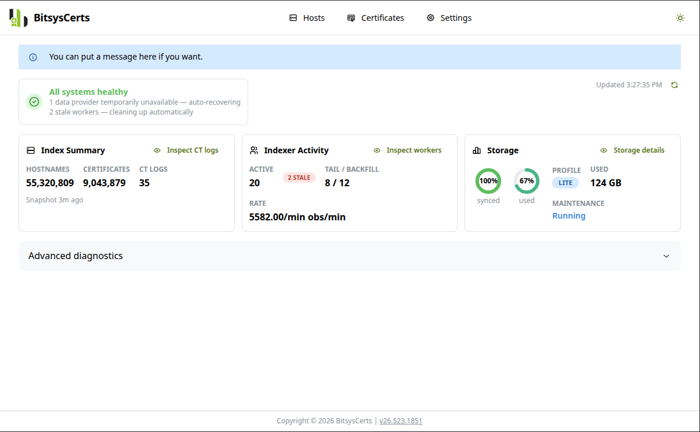
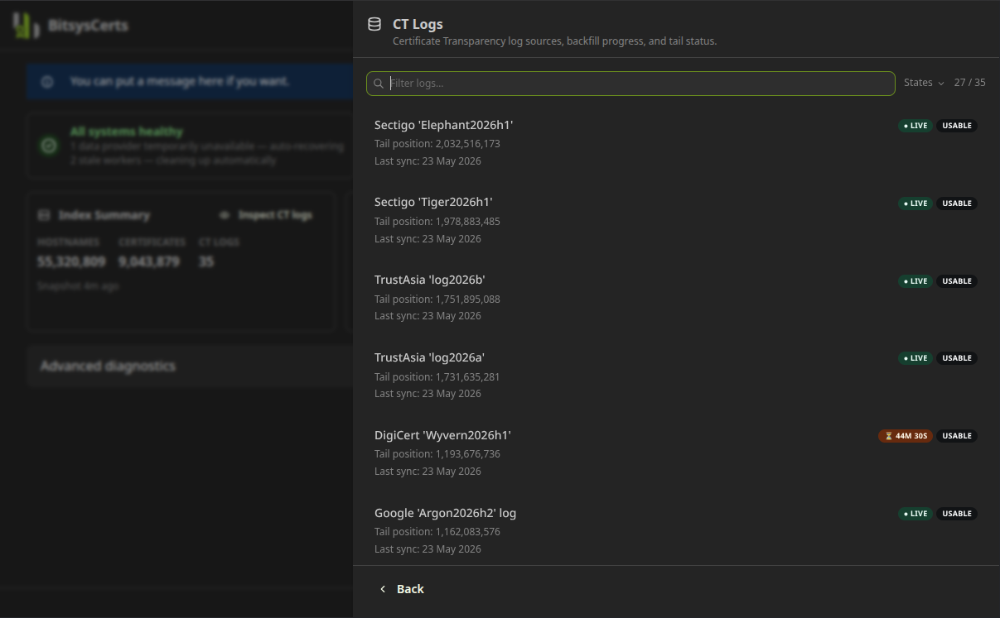
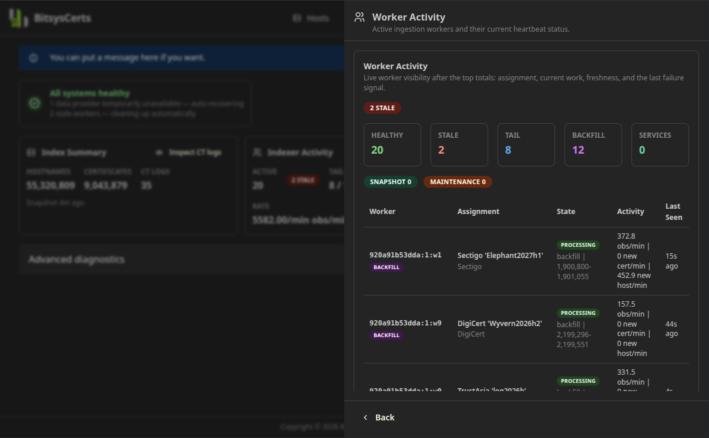
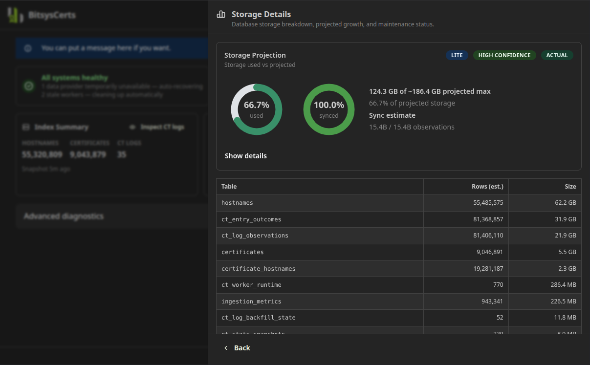
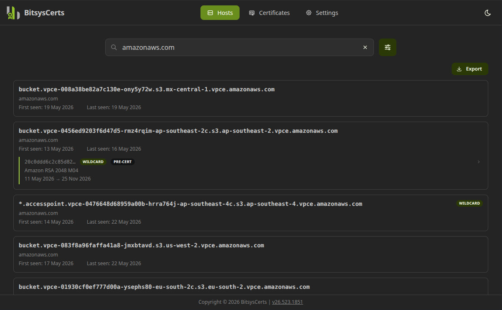
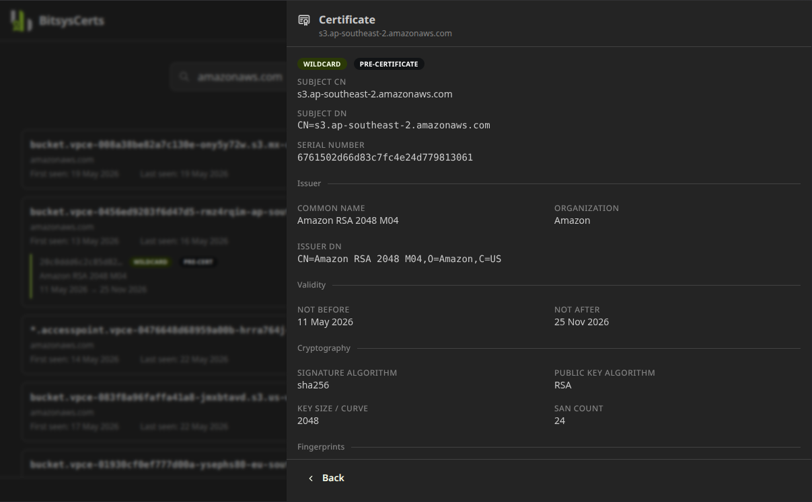
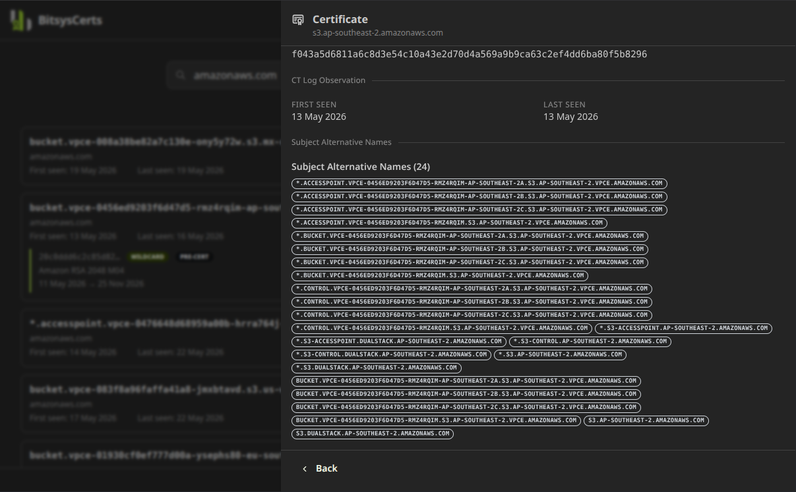
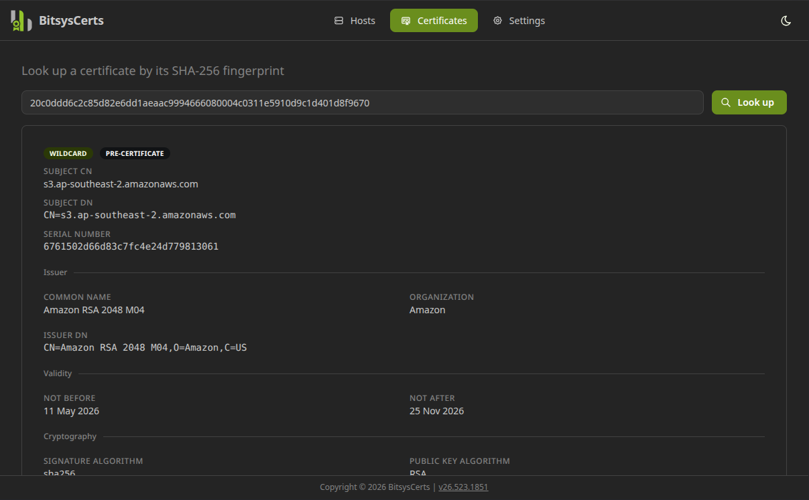
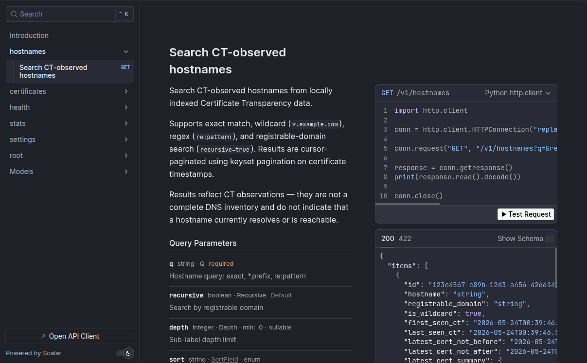

# Screenshots

The primary purpose of this service is to have an API that you can call to get hostnames. For example:

```bash
curl -i "http://ctpool1.lab.bitsyscerts.com:8000/v1/hostnames?q=cisco.com&recursive=true&limit=2"
```

and get a response like this:

```json
HTTP/1.1 200 OK
date: Sun, 24 May 2026 00:45:22 GMT
server: uvicorn
content-length: 1572
content-type: application/json

{
  "items": [
    {
      "id": "96998f85-6497-4931-aca4-4777dceb1085",
      "hostname": "containers.dmz.cisco.com",
      "registrable_domain": "cisco.com",
      "is_wildcard": false,
      "first_seen_ct": "2026-05-16T05:11:13.521715Z",
      "last_seen_ct": "2026-05-22T10:53:28.892559Z",
      "latest_cert_not_before": "2026-05-15T09:40:48Z",
      "latest_cert_not_after": "2026-06-24T09:39:48Z",
      "latest_cert_summary": {
        "fingerprint_sha256": "78a8aa6a7a2df4d81219e3b5f84fedc243cb98c155b7ae75a65c12d12c608a8e",
        "not_before": "2026-05-15T09:40:48Z",
        "not_after": "2026-06-24T09:39:48Z",
        "issuer_cn": "HydrantID Server CA O1",
        "issuer_org": "IdenTrust",
        "subject_cn": "containers.dmz.cisco.com",
        "is_precert": true,
        "seen_at": "2026-05-22T10:53:28.892559Z"
      },
      "latest_cert": null
    },
    {
      "id": "d72d4150-9ffd-460e-bc0e-d14eea5e35fb",
      "hostname": "vapp-10-23-222-156.cisco.com",
      "registrable_domain": "cisco.com",
      "is_wildcard": false,
      "first_seen_ct": "2026-05-13T06:49:14.519852Z",
      "last_seen_ct": "2026-05-14T03:58:16.348449Z",
      "latest_cert_not_before": "2026-05-13T06:07:48Z",
      "latest_cert_not_after": "2026-06-22T06:06:48Z",
      "latest_cert_summary": {
        "fingerprint_sha256": "5b6cc4ae364007322740635c18e9feae61daf8363b8fad109a6e8d1b443370a3",
        "not_before": "2026-05-13T06:07:48Z",
        "not_after": "2026-06-22T06:06:48Z",
        "issuer_cn": "HydrantID Server CA O1",
        "issuer_org": "IdenTrust",
        "subject_cn": "vapp-10-23-222-156.cisco.com",
        "is_precert": true,
        "seen_at": "2026-05-14T03:58:16.348449Z"
      },
      "latest_cert": null
    }
  ],
  "next_cursor": "eyJzb3J0Ijoibm90X2JlZm9yZV9kZXNjIiwidHNfbXMiOjE3Nzg2NTI0NjgwMDAsImlkIjoiZDcyZDQxNTAtOWZmZC00NjBlLWJjMGUtZDE0ZWVhNWUzNWZiIn0=",
  "total_returned": 2,
  "total_estimate": 10001
}

```

However, if you need a simple web interface to query from, and to see the status of the system, there is a small Vite React website included too.

## Dashboard

This is theme-aware, so you can set it to light, dark, or system - where it follows the theme of your  device:



And here is dark mode:


### CT Logs Slideout

This shows you details of Certificate Transparency (CT) Logs that we known about, and how in-sync we are with them:



### Worker Activity Slideout

This is a view of the various workers that are running to keep the system up to date. This includes a look at the forward, and also reverse looking sync workers, a stats snapshotter (due to the size of the data), and a maintenance worker who cleans and prunes:



### Storage Details Slideout

This gives a detailed view of how much disk space is being used, how many rows of data, etc:



## Host Lookup

This is where you can look up a host by exact name, wildcard, Regular Expression, and you can research to n-level of depth, like `*.london-office.labs.example.com` will return any hosts from this level, or any level below it:



You can output this list as JSON, CSV, or in XLSX format.

### Certificate Slideout

If you choose to include certificates, this slideout shows you most of the certificate metadata (depending on your Storage Profile).



This also include the Subject Alternative Names (SAN)'s for the cert too, which we collect as valid/known hostnames also:



## Certificates

You can look up a certificate directly by its SHA-256 fingerprint:



## API Swagger Docs

Again, the primary purpose of this is to have a REST API that makes this data available to you. You can navigate to the `/docs` URL of your API endpoint URL and see API documentation:


And even try out the API endpoint and get real data back:



---

To clarify, this platform would run on *your* hardware. It doesn't require any API keys or anything. You basically just stand up the service and it starts populating the database certs and hostnames within a minute.
